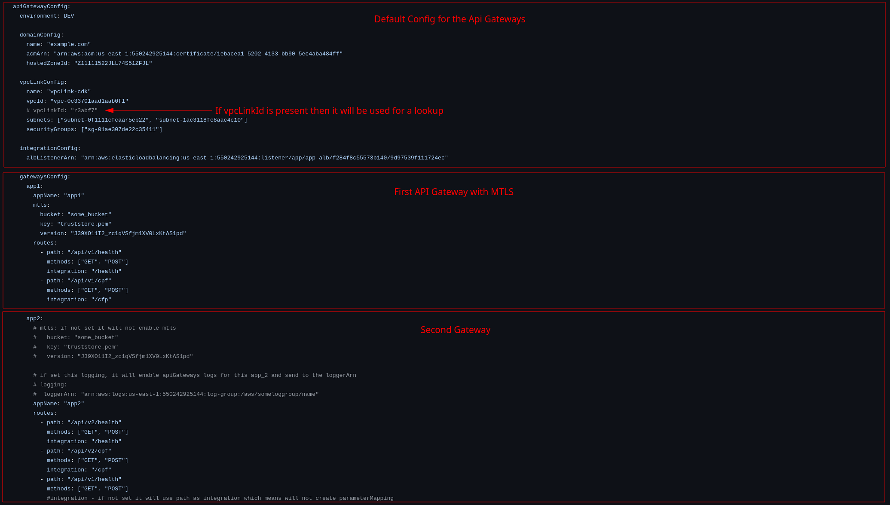

# Welcome to your CDK Go project!

This is a blank project for CDK development with Go.

The `cdk.json` file tells the CDK toolkit how to execute your app.

## Useful commands

- `cdk deploy` deploy this stack to your default AWS account/region
- `cdk diff` compare deployed stack with current state
- `cdk synth` emits the synthesized CloudFormation template

# Doc Image

- The first block is for all api gateways. Just default config for setup the domains, vpclink and integrationListener.
- The gatewaysConfig is a list of apigateways.

